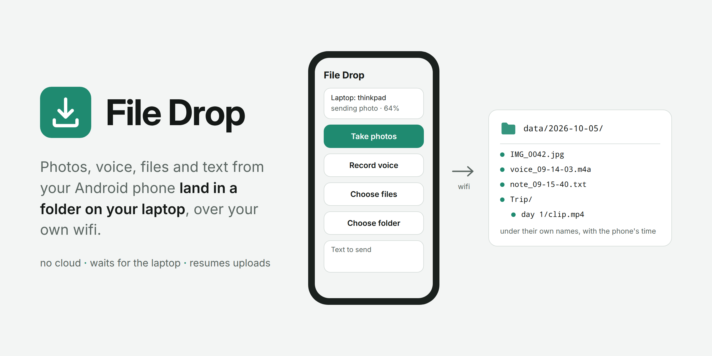

# File Drop

<picture>
  <source media="(prefers-color-scheme: dark)" srcset="img/cover-dark.png">
  
</picture>

An Android app that only sends: take photos, record a voice note, pick
files or a whole folder, type a text, and it all lands in a folder on your
laptop. No cloud, no cable, no account. The laptop runs a small server on
the home wifi; the app finds it by itself, keeps everything on the phone
while the laptop is away, and sends it the moment the laptop is back.

## Start

    bin/configure
    bin/build
    bin/run

`bin/run` starts the server; Ctrl-C stops it. Files land in `data/`, one
folder per day: `data/2026-10-05/photo_2026-10-05_09-14-03.jpg`. The startup
log prints the URL to open on the phone, where the page links to the app.

## Docs

- [Phone](docs/phone.md): install the app, and what each button does
- [Server](docs/server.md): ports, `data/`, running without docker
- [Android app](docs/android.md): the build, updates, the keystore
- [How sending works](docs/protocol.md): the outbox, resumable uploads, discovery
- [Troubleshooting](docs/troubleshooting.md)
